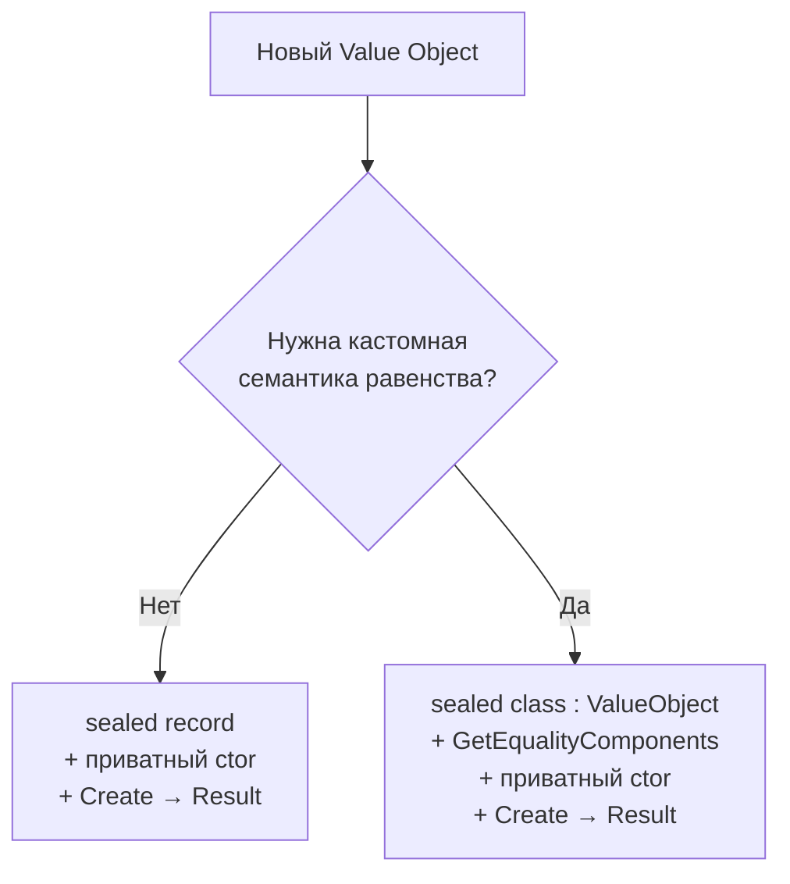

# ADR-004: ValueObject — двойной подход: C# record (по умолчанию) + абстрактный базовый класс (сложные случаи)

**Статус:** ✅ Принято  
**Дата:** 2026-05-10  

---

## 1. Контекст

В доменной модели библиотеки Koto Value Objects (объекты-значения) используются повсеместно: `Email`, `PhoneNumber`, `Money`, `Address` и др. Ключевые свойства VO — иммутабельность, семантика равенства по значению и «всегда валидное» состояние (no invalid state representation).

В C# исторически VO реализуется через абстрактный базовый класс `ValueObject` с переопределением `Equals`/`GetHashCode`. С C# 9 появились `record`-типы, которые предоставляют структурное равенство из коробки. Возникает вопрос: какой из подходов использовать?

Проблема в том, что ни один из подходов не покрывает все случаи одинаково хорошо:
- `record` даёт равенство по **всем** свойствам без возможности кастомизации.
- Абстрактный базовый класс даёт полный контроль, но требует шаблонного кода даже для тривиальных VO.

Необходимо зафиксировать прагматичное правило выбора, которое будет понятно каждому разработчику.

---

## 2. Требования

### Функциональные

| Требование | Описание |
|---|---|
| Структурное равенство | VO должны сравниваться по значению, а не по ссылке |
| Кастомная семантика равенства | Часть VO требует нормализации перед сравнением (например, `"usd" == "USD"`) |
| Всегда валидное состояние | Создание VO с невалидными данными должно быть невозможным; фабричный метод возвращает `Result<T>` |
| Иммутабельность | После создания состояние VO не должно изменяться |
| Единый паттерн фабрики | Оба подхода используют приватный конструктор + статический `Create(...)` |

### Нефункциональные

| Категория | Требование | Критичность |
|---|---|---|
| Читаемость | Простые VO (Email, Url) не должны содержать лишний шаблонный код | Высокая |
| Расширяемость | Должна быть возможность добавить кастомную логику равенства без переработки всего VO | Высокая |
| Совместимость с EF Core | VO должны корректно работать как Owned Entity или Value Conversion | Средняя |
| Идиоматичность | Подход должен соответствовать современному C# (9+) | Средняя |
| Минимум зависимостей | Абстрактный базовый класс реализуется внутри Koto, без внешних NuGet-зависимостей | Низкая |

---

## 3. Решение

### Описание

Koto поддерживает **два подхода** к реализации Value Objects. Выбор между ними определяется одним правилом:

> **Начинай с `record`. Переходи к `ValueObject`-базовому классу только тогда, когда нужна нестандартная семантика равенства.**

---

**Подход 1 (по умолчанию): C# `record`**

Применяется когда структурное равенство по **всем** свойствам корректно.

```csharp
public sealed record Email
{
    public string Value { get; }
    private Email(string value) => Value = value;

    public static Result<Email> Create(string value)
    {
        if (string.IsNullOrWhiteSpace(value))
            return Errors.General.ValueIsRequired("email");
        if (value.Length > 150)
            return Errors.General.InvalidLength(1, 150);
        return new Email(value);
    }
}
```

C# `record` предоставляет структурное равенство без базового класса. Это идиоматичный современный C#.

---

**Подход 2 (сложные случаи): абстрактный базовый класс `ValueObject`**

Применяется когда равенство должно быть определено по **подмножеству** свойств (нормализация, исключение кэшированных полей и т.п.).

```csharp
public abstract class ValueObject
{
    protected abstract IEnumerable<object?> GetEqualityComponents();

    public override bool Equals(object? obj)
    {
        if (obj is null || obj.GetType() != GetType()) return false;
        return GetEqualityComponents()
            .SequenceEqual(((ValueObject)obj).GetEqualityComponents());
    }

    public override int GetHashCode() =>
        GetEqualityComponents()
            .Aggregate(0, HashCode.Combine);

    public static bool operator ==(ValueObject? a, ValueObject? b) =>
        a is null ? b is null : a.Equals(b);

    public static bool operator !=(ValueObject? a, ValueObject? b) => !(a == b);
}

// Пример: Money нормализует код валюты к верхнему регистру
public sealed class Money : ValueObject
{
    public decimal Amount { get; }
    public string Currency { get; }

    private Money(decimal amount, string currency)
    {
        Amount = amount;
        Currency = currency;
    }

    public static Result<Money> Create(decimal amount, string currency)
    {
        if (amount < 0)
            return Errors.General.ValueIsInvalid("amount");
        if (string.IsNullOrWhiteSpace(currency))
            return Errors.General.ValueIsRequired("currency");
        return new Money(amount, currency);
    }

    protected override IEnumerable<object?> GetEqualityComponents()
    {
        yield return Amount;
        yield return Currency.ToUpperInvariant(); // нормализация!
    }
}
```



---

### Аргументация

| Критерий | Обоснование |
|---|---|
| Простота для тривиальных VO | `record` устраняет шаблонный код: не нужно писать `Equals`, `GetHashCode`, операторы |
| Гибкость для сложных VO | `ValueObject` база позволяет явно перечислить компоненты равенства и применить нормализацию |
| Единый паттерн валидации | Оба подхода используют `private constructor + static Create → Result<T>`, что соответствует принципу «always valid domain model» (Хориков) |
| Идиоматичность | `record` — идиоматичный C# 9+; разработчики ожидают его для простых VO |
| Явность выбора | Правило «начни с record» устраняет неопределённость и делает код предсказуемым |

#### Последствия

**Положительные:**
- Простые VO (`Email`, `PhoneNumber`, `Url`) получают минимальный, читаемый код
- Сложные VO (`Money`, `Address`) получают полный контроль над семантикой равенства
- Единый паттерн `Create → Result` обеспечивает «always valid» во всём домене
- `record` поддерживает деконструкцию и `with`-выражения — полезные дополнительные возможности
- Нет внешних зависимостей: `ValueObject` — внутренний тип Koto

**Негативные:**
- Два подхода в одной кодовой базе — разработчик должен знать правило выбора
- `record` нельзя использовать с наследованием VO (если `Money : ValueObject`, то `record` не подходит)
- EF Core: `record` с `Value Conversion` работает, но `Owned Entity` требует дополнительной настройки

**Зависимости:**
- `ValueObject` абстрактный класс должен быть определён в ядре библиотеки Koto до реализации любого VO на его основе
- Все VO, использующие EF Core `Owned Entity`, должны быть проверены на совместимость с выбранным подходом
- Паттерн `Result<T>` (библиотека ошибок) должен быть доступен до реализации VO

---

### 4. Альтернативы

| Вариант | Плюсы | Минусы | Почему отклонён |
|---|---|---|---|
| Только `record` | Единообразие; минимум кода; идиоматичность | Нельзя нормализовать значения перед сравнением; равенство по всем свойствам, включая кэшированные | Не покрывает случаи с нормализацией (`"usd" == "USD"`) и сложной логикой равенства |
| Только абстрактный базовый класс | Полный контроль; единый подход | Избыточный шаблонный код для простых VO; менее идиоматичен в C# 9+ | Излишне сложен для тривиальных VO; снижает читаемость |
| `struct` | Семантика значения; выделение на стеке | Нет наследования; сложная интеграция с EF Core; boxing при использовании в коллекциях | Плохо интегрируется с EF Core; наследование от `ValueObject` невозможно |
| Интерфейс `IValueObject` | Маркер типа; совместим с любой реализацией | Не помогает с равенством; каждый VO всё равно реализует `Equals`/`GetHashCode` вручную | Не решает проблему: маркер без реализации равенства |

---

### 5. Риски

1. **Неправильный выбор подхода разработчиком**  
   Разработчик может применить `record` там, где нужна нормализация, и получить скрытый баг (например, `"usd" != "USD"`).  
   *Меры:* Задокументировать правило выбора в CLAUDE.md и code review checklist; добавить примеры в документацию; рассмотреть Roslyn Analyzer для обнаружения потенциально проблемных `record`-VO.

2. **Несовместимость с EF Core при смене подхода**  
   Переход с `record` на `ValueObject`-класс в уже запущенном проекте может потребовать миграции БД, если EF Core конфигурация зависит от типа.  
   *Меры:* Фиксировать решение об EF Core маппинге одновременно с выбором подхода VO; покрыть критичные VO интеграционными тестами с EF Core.

3. **Дивергенция двух подходов со временем**  
   По мере развития библиотеки паттерны `record`-VO и `ValueObject`-VO могут начать расходиться (разные соглашения по валидации, именованию и т.д.).  
   *Меры:* Поддерживать единый шаблон `Create → Result<T>` как обязательный для обоих подходов; регулярно проводить ревью существующих VO на соответствие паттерну.
